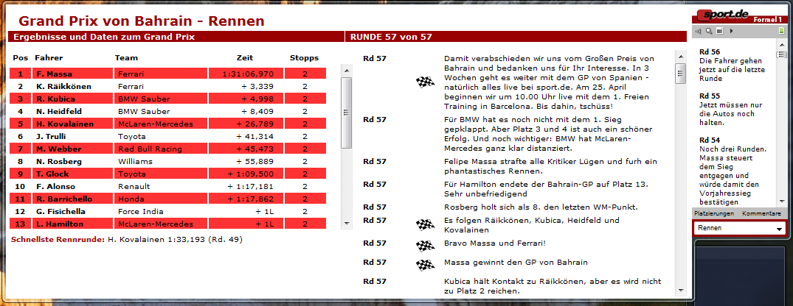

**This project was originally hosted at [CodePlex](https://f1ticker.codeplex.com/).**

# Formula 1 Live Text Ticker
## Windows Vista Sidebar Gadget

A Windows Vista sidebar gadget which displays the Formula 1 live text ticker from the website [http://sport.rtl.de](http://sport.rtl.de) in the Windows Vista sidebar.

The project homepage can be found at [http://www.juergentreml.de](http://www.juergentreml.de/programming/formula-1-windows-vista-sidebar-gadget). There you'll find quite a bunch of screeshots as well as feature and usage explanations. Besides, the gadget can also be found at Windows Live Gallery [here](http://gallery.live.com/liveItemDetail.aspx?li=da29124b-7c82-46ee-985d-a81492a2bc14).

